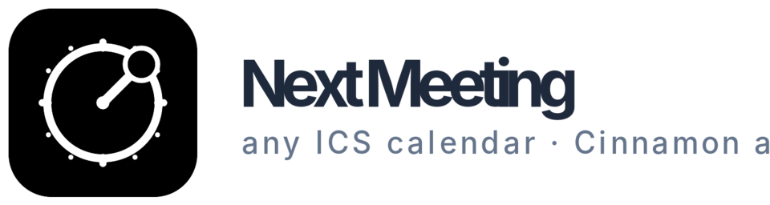

<p align="center">
  
</p>

<p align="center">
  <em>A clean, minimalist Cinnamon panel applet that shows your <strong>next meeting</strong> in the panel —<br>
  with countdown, in-progress indicator, conflict detection and desktop notifications.</em>
</p>

<p align="center">
  <a href="#install"></a>
  
  
  
</p>

---

Works with **any standard ICS/iCal URL** — Google Calendar, Outlook, Apple Calendar, Nextcloud, Fastmail, Proton Calendar, or any RFC 5545 compliant feed.

## Features

- Shows your next meeting (today only) in the Cinnamon panel
- `✓` minimalist icon when today's meetings are done — never shows next-day meetings
- In-progress indicator with elapsed time
- All-day events appear in the popup with a `◼` badge — never pollute the panel
- Configurable timer position: before or after the meeting name
- Marquee / scrolling text for long meeting names (icon stays put)
- Multi-calendar support with per-calendar color
- Tentative meeting detection (via `X-MICROSOFT-CDO-BUSYSTATUS`)
- Time conflict detection and notifications
- Snooze notifications (5 / 15 min) directly from the desktop notification
- Privacy modes:
  - **Hidden Mode** — countdown only
  - **Hide subject** — keep the time visible, hide meeting names
  - **No Display** — icon only
- Multiple panel instances (e.g. one for work, one for personal)
- Auto-detected i18n (English source, Brazilian Portuguese translation included)
- Desktop notifications before meetings start

## Install

```bash
git clone https://github.com/caio-hat/cinnamon-applet-next-meeting.git
cd cinnamon-applet-next-meeting
bash setup.sh
cinnamon --replace &
```

Then right-click the panel → **Add applets to the panel** → find **Next Meeting** → **+**.

## Configure

Right-click the applet → **Configure...** (or click → Settings).

Add one or more ICS/iCal URLs in the **Calendars** list. Example URLs:

| Provider          | Where to find your ICS URL                                    |
| ----------------- | ------------------------------------------------------------- |
| Google Calendar   | Calendar settings → Integrate calendar → Secret address (ICS) |
| Outlook (M365)    | Calendar settings → Shared calendars → Publish a calendar     |
| Apple Calendar    | Calendar → Share Calendar → Public Calendar URL               |
| Nextcloud         | Calendar → Edit → Copy private link (`.ics`)                  |

## Requirements

- Cinnamon 4.0+ (tested on Linux Mint 20, 21, 22)
- Python 3.6+
- `python3-icalendar` and `python3-recurring-ical-events` (auto-installed by `setup.sh`)

## License

MIT — see [LICENSE](LICENSE).

## Contributing

Contributions welcome. Add a new language by copying `next-meeting@caio-hat/files/next-meeting@caio-hat/po/next-meeting@caio-hat.pot` to `<lang>.po` and translating the strings.

## Brand

<p align="left">
  
</p>

Source files: [`logo.svg`](./logo.svg) · [`next-meeting@caio-hat/icon.svg`](./next-meeting%40caio-hat/icon.svg). Tile gradient `#1e88e5 → #3949ab`; accent `#ff7043`.
